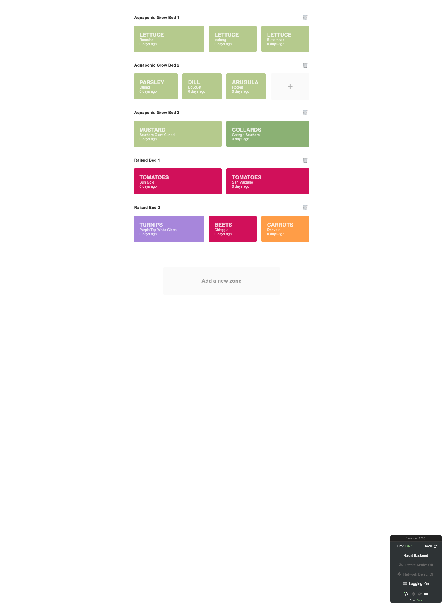
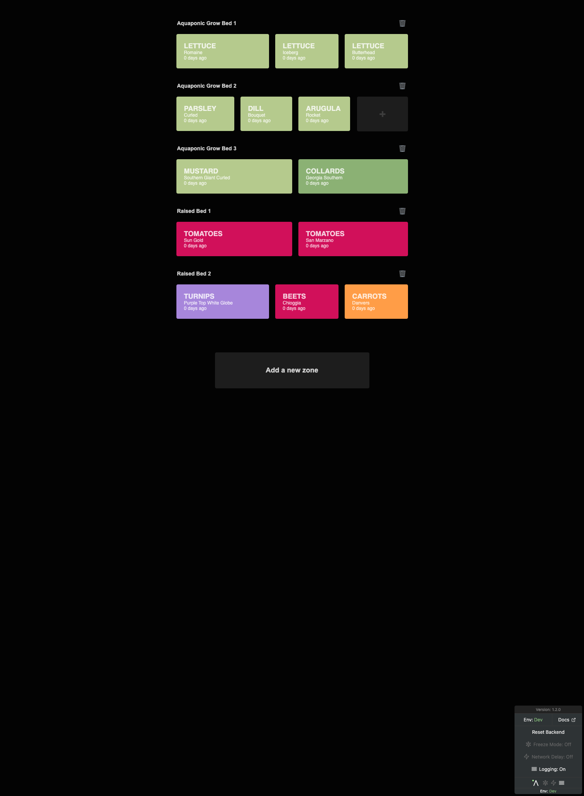

# whatsgrowingon

Keep track of what is growing (_on_) in your garden. Built with [Lamdera](https://lamdera.com).

Visit the [website](https://whatsgrowingon.lamdera.app/) to see it in action.

## ROADMAP

- [ ] Search/filtering when adding planting
- [ ] Planting notes
- [ ] Zone notes
- [ ] Adding new varieties
- [ ] Adding new plants
- [ ] Authentication / Multi-user support
- [ ] Harvest records
- [ ] Planting records
- [ ] Spatial zone mapping
- [ ] Scheduled plantings
- [ ] A11y
